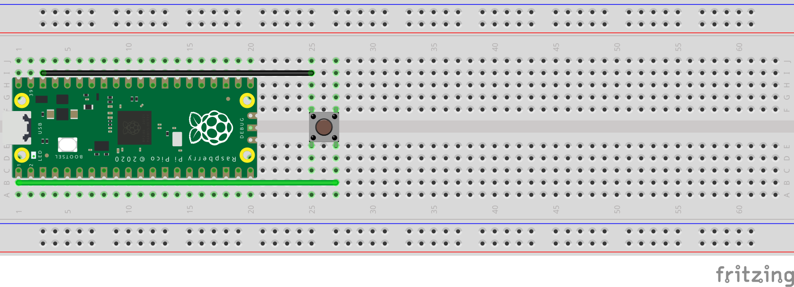

# Internal LED Button:
Schematic - See below the schematic for instructions:
 

 
What You Will Need:
- 1 x Raspberry Pi Pico
- 1 x Breadboard
- 2 x Jumper Wires
- 1 x Push Button

Setting Up The Circuit:
1. Make the circuit: \
   Push Button Pin 1 => GND(-) On Raspberry Pi Pico \
   Push Button Pin 2 => GPIO 0 On Raspberry Pi Pico
2. Open Thonny on your Raspberry Pi.
3. Create a file named main.py.
4. Copy the [main.py](main.py) file from my GitHub and paste it in the main.py file you have just created.
5. Click the run button in Thonny.
6. Press the push button to toggle the LED