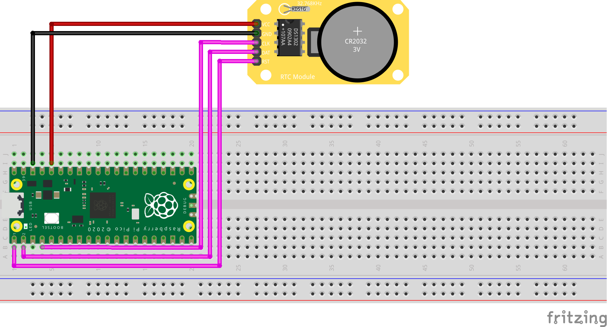

# DS1302 RTC:
Schematic - See below the schematic for instructions:
 

 
What You Will Need:
- 1 x Raspberry Pi Pico
- 1 x Breadboard
- 5 x Jumper Wires
- 1 x DS1302 RTC

Setting Up The Circuit:
1. Make the circuit: \
   DS1302 RTC VCC(+) => 3.3v On Raspberry Pi Pico \
   DS1302 RTC GND(-) => GND(-) On Raspberry Pi Pico \
   DS1302 RTC CLK => GPIO 2 On Raspberry Pi Pico \
   DS1302 RTC DAT => GPIO 1 On Raspberry Pi Pico \
   DS1302 RTC RST => GPIO 0 On Raspberry Pi Pico
2. Open Thonny on your Raspberry Pi.
3. Create a file named main.py.
4. Copy the [main.py](main.py) file from my GitHub and paste it in the main.py file you have just created.
5. Click the run button in Thonny.
6. Stop the program, then insert a '#' before 'setCurrentDate()' on line 30.
7. Click the run button in Thonny.