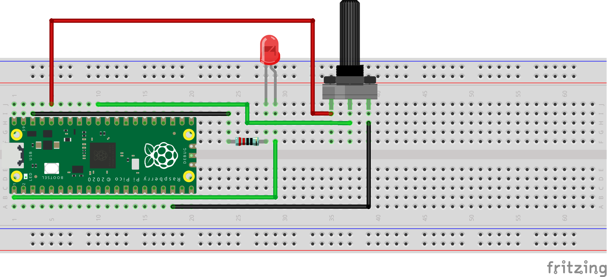

# External LED Dimmer:
Schematic - See below the schematic for instructions:
 

 
What You Will Need:
- 1 x Raspberry Pi Pico
- 1 x Breadboard
- 5 x Jumper Wires
- 1 x LED
- 1 x 220Ω Resistor
- 1 x Potentiometer

Setting Up The Circuit:
1. Make the circuit: \
   LED GND(-) => 220Ω Resistor => GND(-) On Raspberry Pi Pico \
   LED VCC(+) => GPIO 0 On Raspberry Pi Pico \
   Potentiometer Pin 1 => 3.3v On Raspberry Pi Pico \
   Potentiometer Pin 2 => GPIO 26 (ADC 0) On Raspberry Pi Pico \
   Potentiometer Pin 3 => GND(-) On Raspberry Pi Pico
2. Open Thonny on your Raspberry Pi.
3. Create a file named main.py.
4. Copy the [main.py](main.py) file from my GitHub and paste it in the main.py file you have just created.
5. Click the run button in Thonny.
6. Rotate the potentiometer to change the brightness of the LED