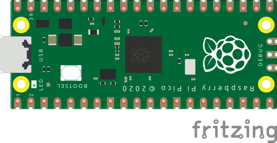

# Internal LED Toggle:
Schematic - See below the schematic for instructions:
 

 
What You Will Need:
- 1 x Raspberry Pi Pico

Setting Up The Circuit:
1. Open Thonny on your Raspberry Pi.
2. Create a file named main.py.
3. Copy the [main.py](main.py) file from my GitHub and paste it in the main.py file you have just created.
4. Click the run button in Thonny.
