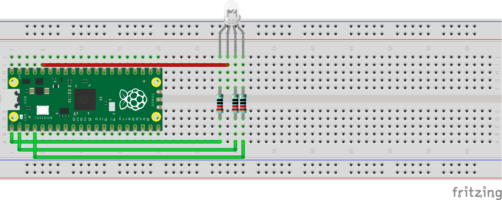

# Simple RGB LED:
Schematic - See below the schematic for instructions:
 

 
What You Will Need:
- 1 x Raspberry Pi Pico
- 1 x Breadboard
- 1 x RGB LED
- 4 x Jumper Wires
- 3 x 220Ω Resistors

Setting Up The Circuit:
1. Make the circuit: \
   RGB LED Pin 1 => 220Ω Resistor => GPIO 0 \
   RGB LED Pin 2 => 3.3v On Raspberry Pi Pico \
   RGB LED Pin 3 => 220Ω Resistor => GPIO 1 \
   RGB LED Pin 4 => 220Ω Resistor => GPIO 2
1. Open Thonny on your Raspberry Pi.
2. Create a file named main.py.
3. Copy the [main.py](main.py) file from my GitHub and paste it in the main.py file you have just created.
4. Click the run button in Thonny.
